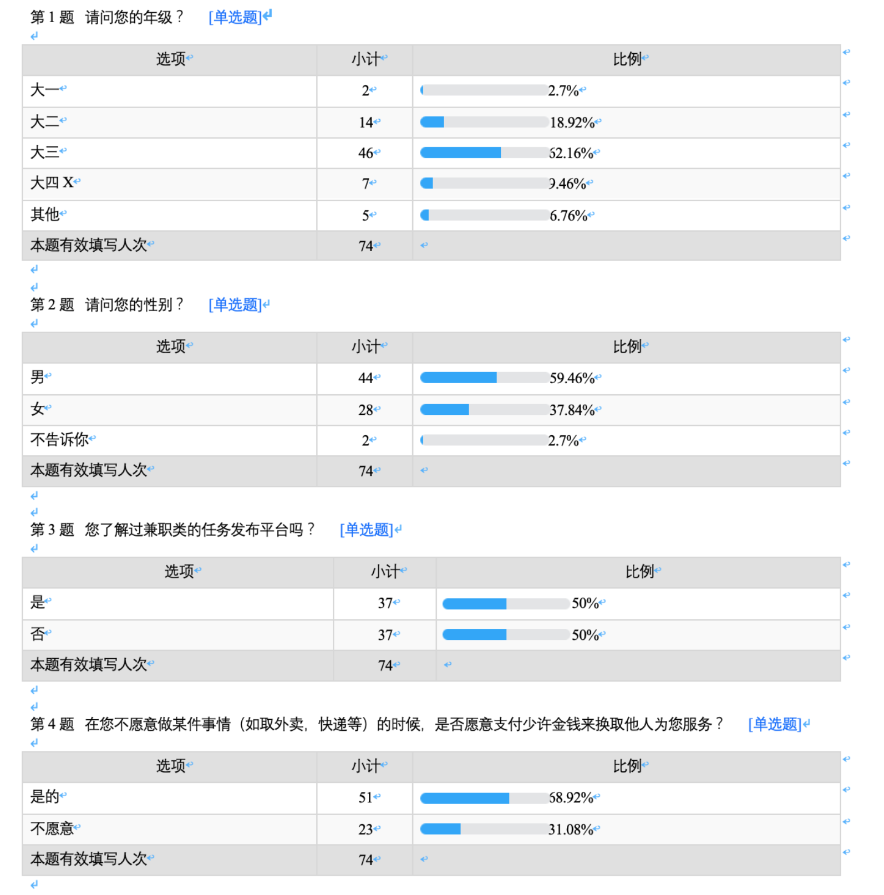
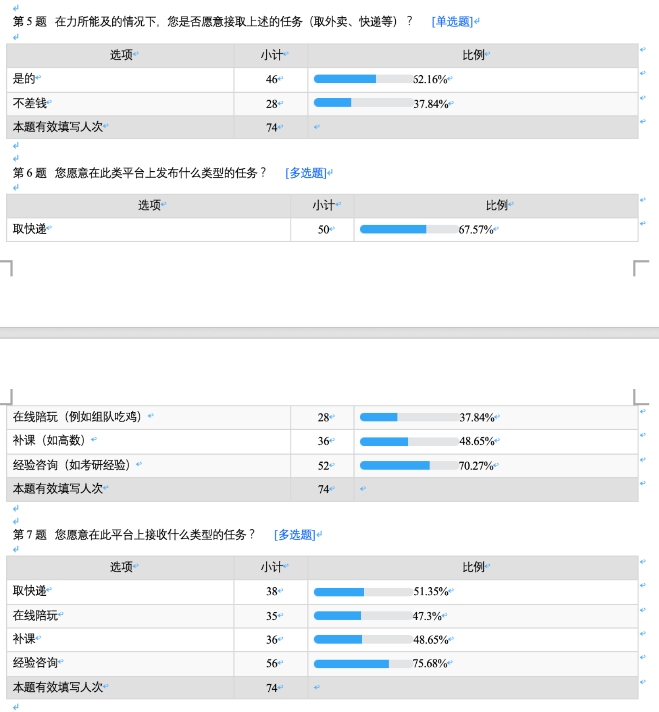

# 羡慕前期调研
{:.no_toc}

* 目录
{:toc}

## 1 选题方向

### 1.1 研究目的

对于学生来说，在大学校园中经常会遇到一些麻烦，比如说一些关于学习方面的问题（保研的要求是什么？）或者说关于生活方面的问题（洗衣机清理的电话是什么？）又或者有的学生经常丢身份证和校园卡，想要动员群众帮忙找回来。又或者自己不在学校，想让别人帮忙取一下快递等事情通过支付一定报酬想让别人代劳。再者想要和小姐姐一起吃鸡，找陪玩等。

上面的种种问题，困扰着许多大学生，因此这时候，一个任务发布平台是是否有必要的，他能帮助需要帮助的同学，并且帮助别人的人还可以在闲暇时间挣的一些报酬，对双方都是及其有利的，因此我们的想法就是做出一款任务发布平台，目的就是让大学生活更加的便利，更加的轻松。

### 1.2 市场现状

随着网络的发展，百度成了大多数人获取信息的途径，但是对于校园生活的问题，有些是通过百度解决不了的（比如查找丢失等），而且百度上的信息不够精确，对于有些特定信息，去百度无异于大海捞针，消耗很多时间。而且在百度上帮忙解决问题的人，有的时候并不能获得一些实质性的报酬。

### 1.3 目标人群

主要对象为年龄段18~28的青年人群，熟悉使用手机app，有微信支付/支付宝支付等在线付款的使用经历，具备现代化的生活消费方式。

## 2 竞品分析

### 2.1 竞品选择

- 目的：进一步了解产品所属相关领域的发展程度和前景，对竞品进行多方面分析，探索产品的竞争优势，并对产品今后的设计提供参考方向和建议。
- 过程：选择生活边常见的任务发布平台、众包平台、招聘平台进行分析，如众包吧、发任务平台等

### 2.2 竞品分析

#### 众包吧

* 目标人群：参加工作，专业能力比较强的工程师
* 产品定位：微信小程序
* 设计特点：功能多样，有接受众包任务、积分商城等使用模块
* 产品优劣：
  * 优点：即时使用的下单小程序
  * 缺点：信息过于隐蔽，难以入门使用，产品附加功能太多，显示上不明确

#### 发任务平台

* 目标人群：参加工作，想要挣钱的工程师，能力不限，要求不明确
* 产品定位：即时接受即时开始的任务接受平台
* 设计特点：色调明亮，提供服务周全合理
* 产品优劣：
  * 优点：提供定位系统，操作简单，可分预约订单和即时订单
  * 缺点：功能单一，交互一般

### 2.3 竞品启发

- 产品理念：产品应突出自身特点，并且在功能全面的同时要保证易于使用。
- 产品架构：采用正规的产品开发统一性框架
- 产品视觉：对象是学生，颜色应该更加的活泼，需要更高的使用舒适度，采用和谐的搭配
- 产品交互：避免功能的相互继承、冲突，采用流程式的交互方法

## 3 用户调研

### 3.1 调研目的

调查当前青年人对于任务托管类平台的了解程度，并且了解学生愿意为任务支付的金额范围，该任务托管平台的开发是有必要的。了解学生生活中经常遇到一些什么问题（生活、学习、娱乐等方面）。

### 3.2 调研方法

调查问卷

### 3.3 调查结果

### 3.4 调研总结

通过调研，可以发现大部分人都愿意使用平台。因此产品的第一目标是满足客户的需求，比如说便利性，为用户带来更好的体验。另外我们需要实时的根据用户的喜好，设置操作方式。我们应该对比较热门的课程减少手续费的收取等。

（未完成）

然后是附件，描述重点产品核心业务流程与交互界面。附件应采用 XP 故事板形式提供，为技术团队提供首次原型迭代提供业务支撑。为了控制成本，**1-3个业务**比较合适！

* X1 产品 Z1 业务
    - 页面流图
    - 页面列表
* Y1 产品 Z2 业务
    - 页面流图
    - 页面列表

## 参考案例（未完成）

* [扫码点餐支付系统竞品报告](https://baoleme.github.io/Dashboard/documents/competitor_analyze.html)
* [项目前期调研](https://sysu-gogo.github.io/sysu-gogo-food-docs/03-investigation)

