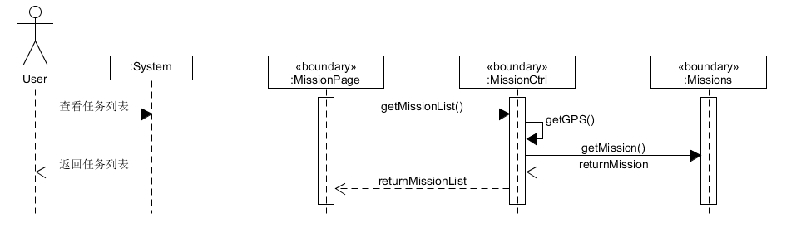
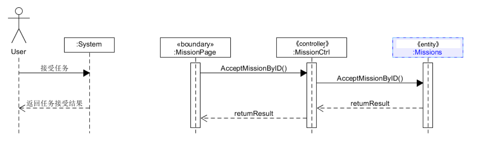
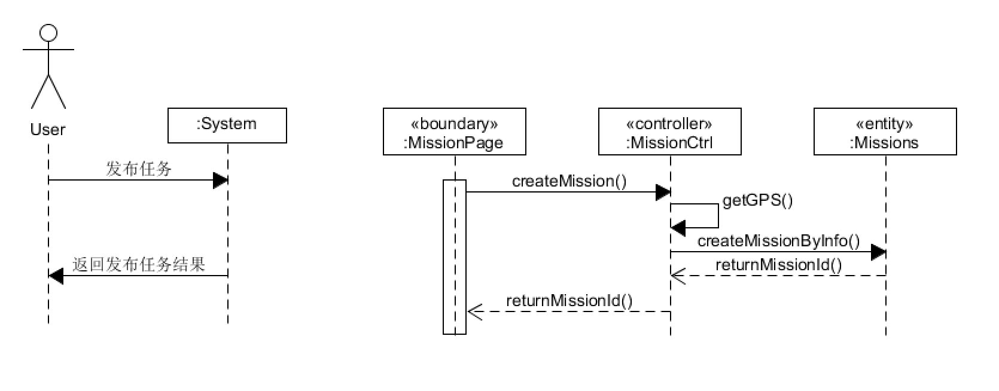

# System Sequence Diagram （功能模型）

根据我们的[用例分析](https://teamwego.github.io/dashboard/06-02-use-cases.html)中的用例图可以看到，用户的大体使用过程是通过用户首先获取任务列表，然后接受并完成任务。同时，我们也应该支持用户发布任务。

## 基本功能

1. 用户获取任务列表
2. 用户完成任务
3. 用户发布任务

* 用户首先进入任务界面，通过根据GPS定位用户地理位置，匹配附近的任务信息并返回。

* 在用户完成任务之后，像服务端发送成功完成的消息，将任务标记成已完成并删除，并且返回结果用于前端显示。

* 用户进入到任务界面下，填写任务信息创建任务，提交后端，后端返回结果用于前端显示。

## 系统顺序图

### 1. 用户获取任务列表

*by 16340264* 

用户在用户页面上查看任务列表来寻找任务

### 2. 用户完成任务

*by 16340264*

用户任务后，在任务界面上显示任务成功完成的信息

### 3. 用户发布任务

*by 16340264*

用户发布任务，在任务界面上可以显示自己成功发送的任务

