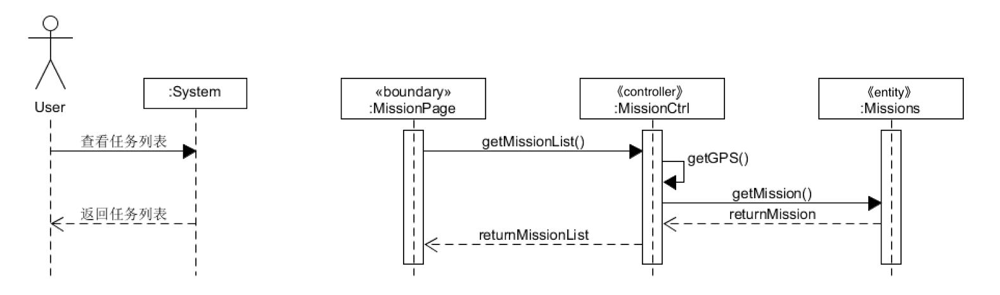

# System Sequence Diagram （功能模型）

根据我们的[用例分析](https://teamwego.github.io/dashboard/06-02-use-cases.html)中的活动图可以看到，用户的大体使用过程是通过用户在任务页面寻找任务，完成任务后在界面上确认。

## 基本功能

1. 用户寻找任务
2. 用户完成任务

用户首先进入任务界面，通过根据GPS获取用户当前的定位，然后获得任务信息。

在用户完成任务之后，像服务端发送成功完成的消息，将任务标记成已完成并删除，并且返回结果用于前端显示。

## 系统顺序图

### 1. 用户寻找任务

*by 16340264* 

用户在用户页面上查看任务列表来寻找任务

### 2. 用户完成任务

*by 16340264*

用户任务后，在任务界面上显示任务成功完成的信息

