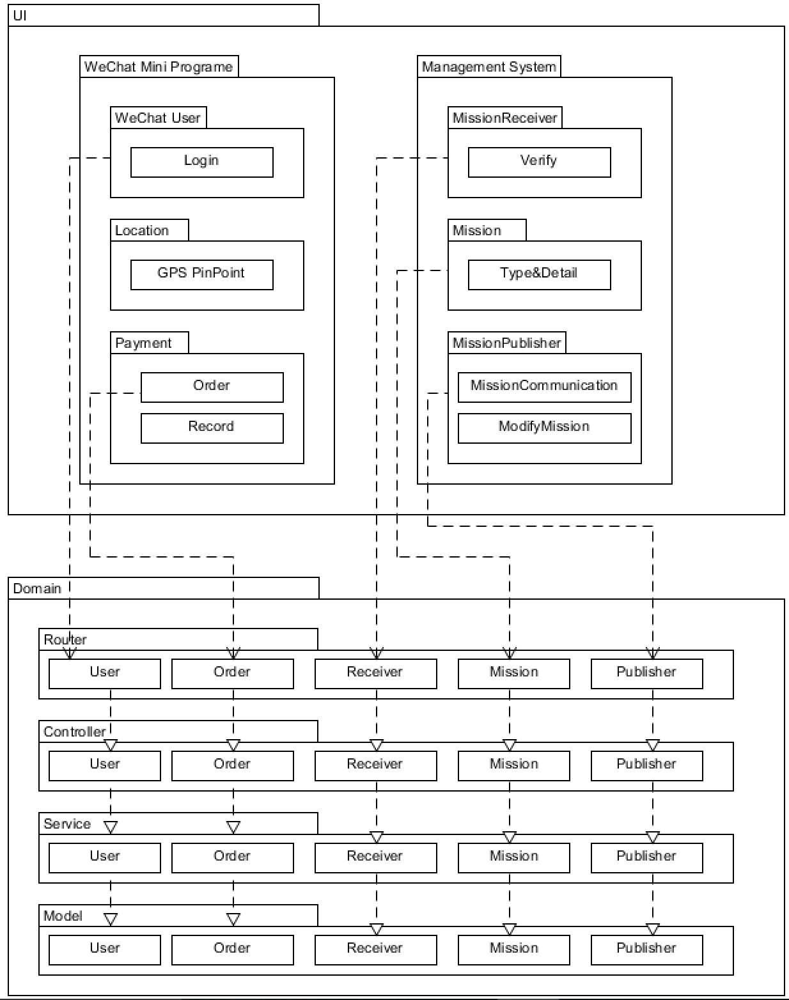
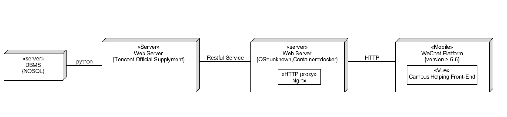

# Software Architecture（架构设计）

## 架构问题

### 可靠性和可恢复性

* 因素：服务器不稳定，不能成功返回结果
* 度量和质量场景：服务器进行心跳检测，当服务器中断后一点时间没有相应，自动重启服务器
* 可变性：在能够重新建立连接之前，简化客户端的服务
* 该因素对涉众、架构以及其他因素的影响 ：服务器经常不稳定会降低客户的体验感
* 对于成功的优先级 ：中
* 困难或风险：高等

### 可支持性和可适用性

* 因素：支持多种可变的第三方服务（位置定位，支付系统等）
* 度量和质量场景：当小程序访问第三方系统时可正常建立连接
* 可变性：通过改变不同第三方的api进行更换
* 该因素对涉众、架构以及其他因素的影响 ：增加系统的可扩展性
* 对于成功的优先级 ：高
* 困难或风险：低等

## 解决方案说明

### 提供服务器并发服务能力

* 提高服务器CPU并发计算能力，增加服务器内存，因此可以支持多线程来处理访问需求
* 当服务器发生崩坏的时候，能够根据日志进行数据库回滚，防止信息丢失
* 限制同时服务的最多用户数，避免服务器负载超荷
* 将一些经常访问的少量数据保存到用户端，当然客户端要有备份，减少通信开销
* 优化数据库，ER模型，在存储空间，查询速度之间做trade-off，设置更合适自己实际情况的数据库
* 优化数据库的查询SQL，避免使用代价高昂的查询，每次查询只返回自己需要的结果；避免短时间内的大量SQL查询

## 逻辑视图

## 部署视图（Deployment Diagram）

