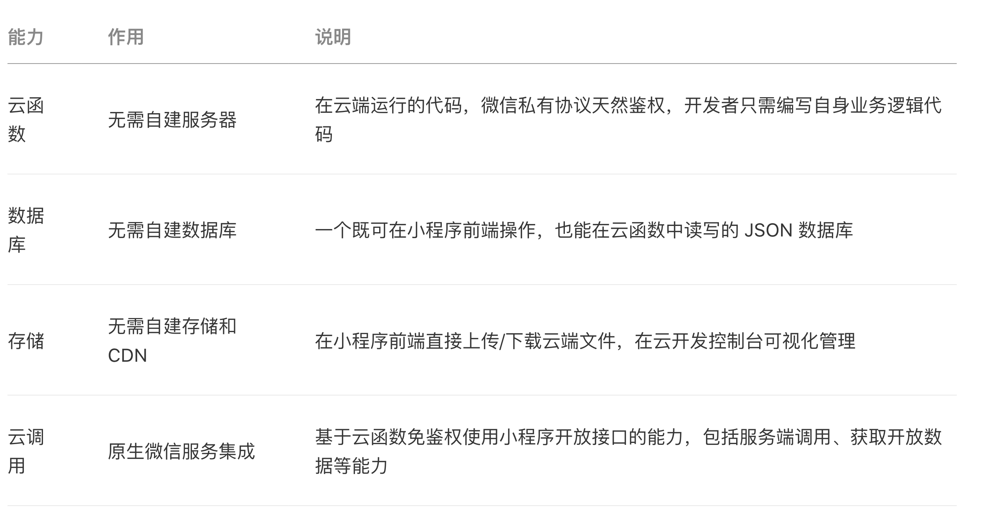

# RESTful API 设计规范

REST API 是一系列个体可描述 (individually-addressable) 的资源（API的名词）的模型。他就是通过HTTP请求来进行和服务器之间的GET和POST等操作。我们的后台是使用云平台来完成的，因此我们不需要主动设计RESTful API。下面主要针对微信云开发进行介绍：

开发者可以使用云开发开发微信小程序、小游戏，无需搭建服务器，即可使用云端能力。云开发为开发者提供完整的原生云端支持和微信服务支持，弱化后端和运维概念，无需搭建服务器，使用平台提供的 API 进行核心业务开发，即可实现快速上线和迭代，同时这一能力，同开发者已经使用的云服务相互兼容，并不互斥。

云开发提供了几大基础能力支持：



## 数据库

云开发提供了一个 JSON 数据库，顾名思义，数据库中的每条记录都是一个 JSON 格式的对象。一个数据库可以有多个集合（相当于关系型数据中的表），集合可看做一个 JSON 数组，数组中的每个对象就是一条记录，记录的格式是 JSON 对象。

关系型数据库和 JSON 数据库的概念对应关系如下表：

| 关系型          | 文档型            |
| :-------------- | :---------------- |
| 数据库 database | 数据库 database   |
| 表 table        | 集合 collection   |
| 行 row          | 记录 record / doc |
| 列 column       | 字段 field        |

以下是一个示例的集合数据，假设我们有一个 `books` 集合存放了图书记录，其中有两本书：

```js
[
  {
    "_id": "Wzh76lk5_O_dt0vO",
    "title": "The Catcher in the Rye",
    "author": "J. D. Salinger",
    "characters": [
      "Holden Caulfield",
      "Stradlater",
      "Mr. Antolini"
    ],
    "publishInfo": {
      "year": 1951,
      "country": "United States"
    }
  },
  {
    "_id": "Wzia0lk5_O_dt0vR",
    "_openid": "ohl4L0Rnhq7vmmbT_DaNQa4ePaz0",
    "title": "The Lady of the Camellias",
    "author": "Alexandre Dumas fils",
    "characters": [
      "Marguerite Gautier",
      "Armand Duval",
      "Prudence",
      "Count de Varville"
    ],
    "publishInfo": {
      "year": 1848,
      "country": "France"
    }
  }
]
```

在图书信息中，我们用 `title`, `author` 来记录图书标题和作者，用 `characters` 数组来记录书中的主要人物，用 `publishInfo` 来记录图书的出版信息。在其中我们可以看到，字段既可以是字符串或数字，还可以是对象或数组，就是一个 JSON 对象。

每条记录都有一个 `_id` 字段用以唯一标志一条记录、一个 `_openid` 字段用以标志记录的创建者，即小程序的用户。需要特别注意的是，在管理端（控制台和云函数）中创建的不会有 `_openid` 字段，因为这是属于管理员创建的记录。开发者可以自定义 `_id`，但不可自定义和修改 `_openid` 。`_openid` 是在文档创建时由系统根据小程序用户默认创建的，开发者可使用其来标识和定位文档。

数据库 API 分为小程序端和服务端两部分，小程序端 API 拥有严格的调用权限控制，开发者可在小程序内直接调用 API 进行非敏感数据的操作。对于有更高安全要求的数据，可在云函数内通过服务端 API 进行操作。云函数的环境是与客户端完全隔离的，在云函数上可以私密且安全的操作数据库。

数据库 API 包含增删改查的能力，使用 API 操作数据库只需三步：获取数据库引用、构造查询/更新条件、发出请求。以下是一个在小程序中查询数据库的发表于美国的图书记录的例子：

```js
// 1. 获取数据库引用
const db = wx.cloud.database()
// 2. 构造查询语句
// collection 方法获取一个集合的引用
// where 方法传入一个对象，数据库返回集合中字段等于指定值的 JSON 文档。API 也支持高级的查询条件（比如大于、小于、in 等），具体见文档查看支持列表
// get 方法会触发网络请求，往数据库取数据
db.collection('books').where({
  publishInfo: {
    country: 'United States'
  }
}).get({
  success: function(res) {
  // 输出 [{ "title": "The Catcher in the Rye", ... }]
  console.log(res)
 }
})
```

更多的数据库的 API 的使用和数据库管理，可以参考[数据库指引](https://developers.weixin.qq.com/miniprogram/dev/wxcloud/guide/database.html)章节。

## 存储

云开发提供了一块存储空间，提供了上传文件到云端、带权限管理的云端下载能力，开发者可以在小程序端和云函数端通过 API 使用云存储功能。

在小程序端可以分别调用 `wx.cloud.uploadFile` 和 `wx.cloud.downloadFile` 完成上传和下载云文件操作。下面简单的几行代码，即可实现在小程序内让用户选择一张图片，然后上传到云端管理的功能：

```js
// 让用户选择一张图片
wx.chooseImage({
  success: chooseResult => {
    // 将图片上传至云存储空间
    wx.cloud.uploadFile({
      // 指定上传到的云路径
      cloudPath: 'my-photo.png',
      // 指定要上传的文件的小程序临时文件路径
      filePath: chooseResult.tempFilePaths[0],
      // 成功回调
      success: res => {
        console.log('上传成功', res)
      },
    })
  },
})
```

上传完成后可在控制台中看到刚上传的图片。

更多的存储 API 和管理，可以参考[存储指引](https://developers.weixin.qq.com/miniprogram/dev/wxcloud/guide/storage.html)章节。

## 云函数

云函数是一段运行在云端的代码，无需管理服务器，在开发工具内编写、一键上传部署即可运行后端代码。

小程序内提供了专门用于云函数调用的 API。开发者可以在云函数内使用 [`wx-server-sdk`](https://developers.weixin.qq.com/miniprogram/dev/wxcloud/guide/functions/wx-server-sdk.html) 提供的 [`getWXContext`](https://developers.weixin.qq.com/miniprogram/dev/wxcloud/reference-server-api/utils/getWXContext.html) 方法获取到每次调用的上下文（`appid`、`openid` 等），无需维护复杂的鉴权机制，即可获取天然可信任的用户登录态（`openid`）。

比如我们如下定义一个云函数，命名为 add ，功能是将传入的两个参数 a 和 b 相加：

```js
// index.js 是入口文件，云函数被调用时会执行该文件导出的 main 方法
// event 包含了调用端（小程序端）调用该函数时传过来的参数，同时还包含了可以通过 getWXContext 方法获取的用户登录态 `openId` 和小程序 `appId` 信息
const cloud = require('wx-server-sdk')
exports.main = (event, context) => {
  let { userInfo, a, b} = event
  let { OPENID, APPID } = cloud.getWXContext() // 这里获取到的 openId 和 appId 是可信的
  let sum = a + b

  return {
    OPENID,
    APPID,
    sum
  }
}
```

在开发者工具中上传部署云函数后，我们在小程序中可以这么调用：

```js
wx.cloud.callFunction({
  // 需调用的云函数名
  name: 'add',
  // 传给云函数的参数
  data: {
    a: 12,
    b: 19,
  },
  // 成功回调
  complete: console.log
})
// 当然 promise 方式也是支持的
wx.cloud.callFunction({
  name: 'add',
  data: {
    a: 12,
    b: 19
  }
}).then(console.log)
```

如需在云函数中操作数据库、管理云文件、调用其他云函数等操作，可使用官方提供的 npm 包 [`wx-server-sdk`](https://developers.weixin.qq.com/miniprogram/dev/wxcloud/reference-server-api/) 进行操作

更多的云函数管理和 API，可以参考[云函数指引](https://developers.weixin.qq.com/miniprogram/dev/wxcloud/guide/functions.html)章节。

## 云调用

云调用是云开发提供的基于云函数使用小程序开放接口的能力，支持在云函数调用服务端开放接口，如发送模板消息、获取小程序码等操作都可以在云函数中完成，详情可见具体[开发指引](https://developers.weixin.qq.com/miniprogram/dev/wxcloud/guide/openapi/openapi.html)。

## HTTP API

### invokeCloudFunction

> 本接口应在服务器端调用，详细说明参见[服务端API](https://developers.weixin.qq.com/miniprogram/dev/framework/server-ability/backend-api.html)。

触发云函数。**注意：HTTP API 途径触发云函数不包含用户信息。**

### 请求地址

```text
POST https://api.weixin.qq.com/tcb/invokecloudfunction?access_token=ACCESS_TOKEN&env=ENV&name=FUNCTION_NAME
```

### 请求参数

| 属性         | 类型   | 默认值 | 必填 | 说明                                                         |
| :----------- | :----- | :----- | :--- | :----------------------------------------------------------- |
| access_token | string |        | 是   | [接口调用凭证](https://developers.weixin.qq.com/miniprogram/dev/api-backend/open-api/access-token/auth.getAccessToken.html) |
| env          | string |        | 是   | 云开发环境ID                                                 |
| name         | string |        | 是   | 云函数名称                                                   |
| POSTBODY     | string |        | 是   | 云函数的传入参数，具体结构由开发者定义。                     |

### 返回值

### Object

返回的 JSON 数据包

| 属性      | 类型   | 说明               |
| :-------- | :----- | :----------------- |
| errcode   | number | 错误码             |
| errmsg    | string | 错误信息           |
| resp_data | string | 云函数返回的buffer |

**errcode 的合法值**

| 值         | 说明                                                         | 最低版本 |
| :--------- | :----------------------------------------------------------- | :------- |
| 0          | 请求成功                                                     |          |
| -1         | 系统错误                                                     |          |
| -1000      | 系统错误                                                     |          |
| 40014      | AccessToken 不合法                                           |          |
| 40101      | 缺少必填参数                                                 |          |
| 41001      | 缺少AccessToken                                              |          |
| 42001      | AccessToken过期                                              |          |
| 43002      | HTTP METHOD 错误                                             |          |
| 44002      | POST BODY 为空                                               |          |
| 85088      | 该APP未开通云开发                                            |          |
| 其他错误码 | [云开发错误码](https://developers.weixin.qq.com/miniprogram/dev/wxcloud/reference/errcode.html) |          |

### 示例代码

```text
curl -d '{}' \
'https://api.weixin.qq.com/tcb/invokecloudfunction?access_token=ACCESS_TOKEN&env=ENV&name=login'
```

### 返回数据示例

```json
{
    "errcode": 0,
    "errmsg": "ok",
    "resp_data": "{\"event\":{\"userInfo\":{\"appId\":\"SAMPLE_APPID\"}},\"appid\":\"SAMPLE_APPID\"}"
}
```

### Tips

1. 使用本API触发云函数，在云函数中无法获取OpenID等用户相关信息，无法使用涉及用户登录态的其他API。
2. 注意 POST BODY 部分会传递给云函数作为输入参数。
3. 由 HTTP API 触发的云函数可以使用云调用。
4. 由 HTTP API 触发云函数的超时时间为5s，请注意云函数的执行时间不能过长。

